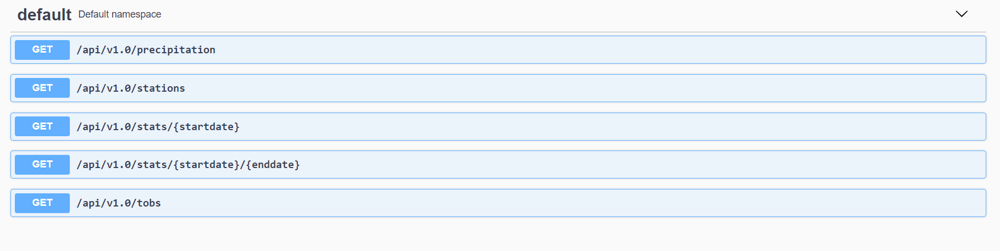

# Surfs Up!
____

### 1 - Climate Analysis and Exploration
____

#### Dependencies
____


```python
import pandas as pd
import sqlalchemy
from sqlalchemy.ext.automap import automap_base
from sqlalchemy.orm import Session
from sqlalchemy import create_engine, func

from datetime import datetime
from dateutil.relativedelta import relativedelta

%matplotlib inline
from matplotlib import style
style.use('fivethirtyeight')
import matplotlib.pyplot as plt
```

#### SQLite
_____


```python
database_path = "../resources/hawaii.sqlite"
engine = create_engine(f"sqlite:///{database_path}", echo=False)
```

#### SQLAlchemy
____


```python
Base = automap_base()
Base.prepare(engine, reflect=True)

Measurement = Base.classes.measurement
Station = Base.classes.station

session = Session(engine)
```

### Precipitation Analysis
_____


```python
# Design a query to retrieve the last 12 months of precipitation data.
max_date = datetime.strptime(session.query(func.max(func.Date(Measurement.date))).scalar(), '%Y-%m-%d')
date_base = max_date - relativedelta(months=12) 

query = session.query(Measurement.date, Measurement.prcp.label('precipitation')).filter(func.Date(Measurement.date) > func.Date(date_base))
precipitation = pd.read_sql(query.statement, session.bind,index_col='date', parse_dates=['date'])
precipitation.sort_index(ascending=True, inplace=True)

precipitation.plot(y='precipitation', figsize=(15,7), title='Precipitation Analysis from the last 12 months')

plt.xlabel("Date")
plt.ylabel("Volume (Inches)")
plt.xticks(rotation='vertical')
plt.autoscale(enable=True,axis='both')

plt.grid(True)
plt.legend(loc='upper center')

plt.tight_layout()
```


```python
precipitation.describe()
```


<div>
<style scoped>
    .dataframe tbody tr th:only-of-type {
        vertical-align: middle;
    }

    .dataframe tbody tr th {
        vertical-align: top;
    }

    .dataframe thead th {
        text-align: right;
    }
</style>
<table border="1" class="dataframe">
  <thead>
    <tr style="text-align: right;">
      <th></th>
      <th>precipitation</th>
    </tr>
  </thead>
  <tbody>
    <tr>
      <th>count</th>
      <td>2015.000000</td>
    </tr>
    <tr>
      <th>mean</th>
      <td>0.176462</td>
    </tr>
    <tr>
      <th>std</th>
      <td>0.460288</td>
    </tr>
    <tr>
      <th>min</th>
      <td>0.000000</td>
    </tr>
    <tr>
      <th>25%</th>
      <td>0.000000</td>
    </tr>
    <tr>
      <th>50%</th>
      <td>0.020000</td>
    </tr>
    <tr>
      <th>75%</th>
      <td>0.130000</td>
    </tr>
    <tr>
      <th>max</th>
      <td>6.700000</td>
    </tr>
  </tbody>
</table>
</div>


### Station Analysis
_____


```python
# Design a query to calculate the total number of stations.
total_stations = session.query(Station.id).count()

print (f'Total of stations : {total_stations}')
```

    Total of stations : 9
    


```python
# List the stations and observation counts in descending order.
query = session.query(Measurement.station, func.count(Measurement.station).label('Observations')).\
group_by(Measurement.station).order_by(func.count(Measurement.station).desc())

pd.read_sql(query.statement, session.bind, index_col='station' )
```


<div>
<style scoped>
    .dataframe tbody tr th:only-of-type {
        vertical-align: middle;
    }

    .dataframe tbody tr th {
        vertical-align: top;
    }

    .dataframe thead th {
        text-align: right;
    }
</style>
<table border="1" class="dataframe">
  <thead>
    <tr style="text-align: right;">
      <th></th>
      <th>Observations</th>
    </tr>
    <tr>
      <th>station</th>
      <th></th>
    </tr>
  </thead>
  <tbody>
    <tr>
      <th>USC00519281</th>
      <td>2772</td>
    </tr>
    <tr>
      <th>USC00519397</th>
      <td>2724</td>
    </tr>
    <tr>
      <th>USC00513117</th>
      <td>2709</td>
    </tr>
    <tr>
      <th>USC00519523</th>
      <td>2669</td>
    </tr>
    <tr>
      <th>USC00516128</th>
      <td>2612</td>
    </tr>
    <tr>
      <th>USC00514830</th>
      <td>2202</td>
    </tr>
    <tr>
      <th>USC00511918</th>
      <td>1979</td>
    </tr>
    <tr>
      <th>USC00517948</th>
      <td>1372</td>
    </tr>
    <tr>
      <th>USC00518838</th>
      <td>511</td>
    </tr>
  </tbody>
</table>
</div>


```python
# Which station has the highest number of observations?

station = session.query(Measurement.station, func.count(Measurement.station)).group_by(Measurement.station).\
order_by(func.count(Measurement.station).desc()).first()

print (f'Station with the highest number of observations({station[1]}) : {station[0]}')
```

    Station with the highest number of observations(2772) : USC00519281
    


```python
# Design a query to retrieve the last 12 months of temperature observation data (tobs)
# Filter by the station with the highest number of observations.
query = session.query(Measurement.station, Measurement.tobs).filter(func.Date(Measurement.date) > func.Date(date_base)).filter(Measurement.station == station[0])
tobs = pd.read_sql(query.statement, session.bind,index_col='station')

# Plot the results as a histogram with bins=12
tobs.plot.hist(by='station', bins=12,  figsize=(15,7),)

plt.title(f'Temperature Observations for Station {station[0]}')
plt.xlabel("Temperature (F)")
plt.autoscale(enable=True,axis='both')

plt.grid(True)
plt.legend(loc='upper right')

plt.tight_layout()
```


### Temperature Analysis
_____


```python
# This function called `calc_temps` will accept start date and end date in the format '%Y-%m-%d' 
# and return the minimum, average, and maximum temperatures for that range of dates
def calc_temps(start_date, end_date):
    """TMIN, TAVG, and TMAX for a list of dates.
    
    Args:
        start_date (string): A date string in the format %Y-%m-%d
        end_date (string): A date string in the format %Y-%m-%d
        
    Returns:
        TMIN, TAVE, and TMAX
    """
    
    return session.query(func.min(Measurement.tobs), func.avg(Measurement.tobs), func.max(Measurement.tobs)).\
        filter(Measurement.date >= start_date).filter(Measurement.date <= end_date).all()


# trip dates
trip_start_date = datetime(2018,4,29)
trip_end_date = datetime(2018, 5, 6)

# previous year dates
p_trip_start_date = trip_start_date - relativedelta(months=12)
p_trip_end_date = trip_end_date - relativedelta(months=12)

measurements = calc_temps(p_trip_start_date, p_trip_end_date)[0]
```


```python
# Plot the min, avg, and max temperature from your previous query as a bar chart.
# Use the average temperature as the bar height.
# Use the peak-to-peak (tmax-tmin) value as the y error bar (yerr).

fig = plt.figure(figsize=(4,8))
ax = fig.add_subplot(1, 1, 1)

ax.set_title('Trip Average Temperature', fontsize=15)
ax.set_ylabel('Temperature(F)')
ax.set_ylim(auto=True)
ax.set_xticks([])

ax.bar(0, measurements[1], yerr=(measurements[2] - measurements[0]), align='center', alpha=0.5, ecolor='black', capsize=10, color='coral')

ax.grid(True)
fig.tight_layout()
```


### Daily Rainfall Average
_____


```python
# Calculate the total amount of rainfall per weather station for your trip dates using the previous year's matching dates.
# Sort this in descending order by precipitation amount and list the station, name, latitude, longitude, and elevation

query = session.query(Station.station, Station.name, Station.latitude, Station.longitude, Station.elevation).\
    join(Measurement, Station.station == Measurement.station).\
    group_by(Station.station).\
    filter(func.Date(Measurement.date) >= func.Date(p_trip_start_date)).\
    filter(func.Date(Measurement.date) <= func.Date(p_trip_end_date)).\
    order_by(func.sum(Measurement.prcp).desc())

rainfall = pd.read_sql(query.statement, session.bind, index_col='station')
rainfall.head(10)
```


<div>
<style scoped>
    .dataframe tbody tr th:only-of-type {
        vertical-align: middle;
    }

    .dataframe tbody tr th {
        vertical-align: top;
    }

    .dataframe thead th {
        text-align: right;
    }
</style>
<table border="1" class="dataframe">
  <thead>
    <tr style="text-align: right;">
      <th></th>
      <th>name</th>
      <th>latitude</th>
      <th>longitude</th>
      <th>elevation</th>
    </tr>
    <tr>
      <th>station</th>
      <th></th>
      <th></th>
      <th></th>
      <th></th>
    </tr>
  </thead>
  <tbody>
    <tr>
      <th>USC00519523</th>
      <td>WAIMANALO EXPERIMENTAL FARM, HI US</td>
      <td>21.33556</td>
      <td>-157.71139</td>
      <td>19.5</td>
    </tr>
    <tr>
      <th>USC00514830</th>
      <td>KUALOA RANCH HEADQUARTERS 886.9, HI US</td>
      <td>21.52130</td>
      <td>-157.83740</td>
      <td>7.0</td>
    </tr>
    <tr>
      <th>USC00513117</th>
      <td>KANEOHE 838.1, HI US</td>
      <td>21.42340</td>
      <td>-157.80150</td>
      <td>14.6</td>
    </tr>
    <tr>
      <th>USC00519281</th>
      <td>WAIHEE 837.5, HI US</td>
      <td>21.45167</td>
      <td>-157.84889</td>
      <td>32.9</td>
    </tr>
    <tr>
      <th>USC00519397</th>
      <td>WAIKIKI 717.2, HI US</td>
      <td>21.27160</td>
      <td>-157.81680</td>
      <td>3.0</td>
    </tr>
    <tr>
      <th>USC00516128</th>
      <td>MANOA LYON ARBO 785.2, HI US</td>
      <td>21.33310</td>
      <td>-157.80250</td>
      <td>152.4</td>
    </tr>
  </tbody>
</table>
</div>


```python
# Create a query that will calculate the daily normals 
# (i.e. the averages for tmin, tmax, and tavg for all historic data matching a specific month and day)

def daily_normals(date):
    """Daily Normals.
    
    Args:
        date (str): A date string in the format '%m-%d'
        
    Returns:
        A list of tuples containing the daily normals, tmin, tavg, and tmax
    
    """
    
    sel = [func.min(Measurement.tobs), func.avg(Measurement.tobs), func.max(Measurement.tobs)]
    return session.query(*sel).filter(func.strftime("%m-%d", Measurement.date) == date).all()
    
# calculate the daily normals for your trip
# push each tuple of calculations into a list called `normals`
# Set the start and end date of the trip
# Use the start and end date to create a range of dates
# Stip off the year and save a list of %m-%d strings
# Loop through the list of %m-%d strings and calculate the normals for each date
# Load the previous query results into a Pandas DataFrame and add the `trip_dates` range as the `date` index

trip_dates = pd.date_range(trip_start_date, trip_end_date)
temps = []

for trip_date in trip_dates.strftime('%m-%d'):
    temps.append(*daily_normals(trip_date))

df_normals = pd.DataFrame(temps, columns = ['tmin', 'tavg', 'tmax'])
df_normals['Date'] = trip_dates
df_normals.set_index('Date', inplace=True)

colors=['skyblue', 'salmon', 'lightgoldenrodyellow']
df_normals.plot(kind='area', figsize=(15, 8), stacked=False, x_compat=True, color=colors, title='Predicted Temperatures for Trip', rot=45)

plt.xlabel("Date")
plt.ylabel("Temperature (F)")
plt.autoscale(enable=True,axis='both')

plt.grid(True)
plt.legend(loc='lower left')

plt.tight_layout()
```


```python

```
### 2 - Climate APP API 
#### Version : 1.0
#### URL : http://localhost:5000/
____

#### Dependencies
____
+ flask-restplus
+ flask-sqlalchemy
+ python-dateutil
+ python_version = 3.7


#### Endpoints
____

