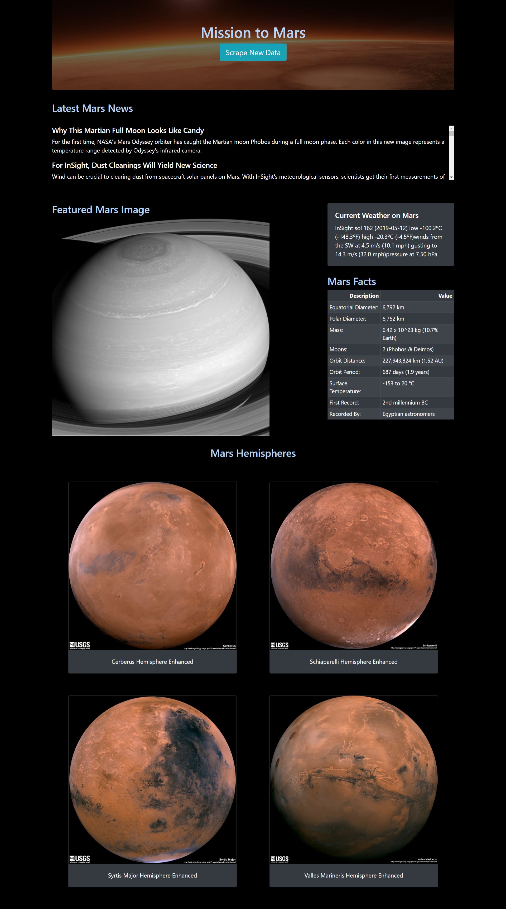

# Mission to Mars

Flask web application that scrapes various websites for data related to the Mission to Mars and displays the information in a single HTML page.

____
## Jupyter Notebok
___ 

### Dependencies
____


```python
from bs4 import BeautifulSoup
from splinter import Browser
from urllib.parse import urlparse
import requests
import pandas as pd
```


```python
# splinter driver location
# google chrome : 74.x

executable_path = {'executable_path': '../resources/webdrivers/chromedriver.exe'}
driver_name = 'chrome'
```

### Nasa Mars News
_____


```python
url = 'https://mars.nasa.gov/news/'

with Browser(driver_name, **executable_path, headless=True) as browser:
    browser.visit(url)
    response = browser.html
    
    soup = BeautifulSoup(response, 'html.parser')
    nasa_news = soup.body.find_all('li', class_='slide')

    for item in nasa_news:
        news_title = item.find('div', class_='content_title').get_text()
        news_p = item.find('div', class_='article_teaser_body').get_text()
    
        print (f'{news_title}\n\t{news_p}\n')  
        
```

    Why This Martian Full Moon Looks Like Candy
    	For the first time, NASA's Mars Odyssey orbiter has caught the Martian moon Phobos during a full moon phase. Each color in this new image represents a temperature range detected by Odyssey's infrared camera.
    
    For InSight, Dust Cleanings Will Yield New Science
    	Wind can be crucial to clearing dust from spacecraft solar panels on Mars. With InSight's meteorological sensors, scientists get their first measurements of wind and dust interacting "live" on the Martian surface.  
    
    InSight Captures Sunrise and Sunset on Mars
    	InSight joins the rest of NASA's Red Planet surface missions, all of which have photographed either the start or end of a Martian day.
    
    NASA Social Media and Websites Win Webby Awards 
    	NASA's social media presence, the InSight mission social media accounts, NASA.gov and SolarSystem.NASA.gov will be honored at the 2019 Webby Awards - "the Oscars of the Internet."
    
    NASA's InSight Detects First Likely 'Quake' on Mars
    	While their causes are still unknown, one of three shaking events looks a lot like the quakes detected on the Moon by the Apollo missions.
    
    Things Are Stacking up for NASA's Mars 2020 Spacecraft
    	As the July 2020 launch date inches closer, the next spacecraft headed to the Red Planet is assembled for more testing.
    
    Curiosity Tastes First Sample in 'Clay-Bearing Unit'
    	This new region on Mars might reveal more about the role of water on Mount Sharp.
    
    More Testing for Mars InSight's 'Mole'
    	After the mission's heat probe began hammering last week, it appears to have hit a rock. The team is analyzing data before they hammer again.
    
    NASA Garners 7 Webby Award Nominations
    	Nominees include four JPL projects: the solar system and climate websites, InSight social media, and a 360-degree Earth video. Public voting closes April 18, 2019.
    
    Curiosity Captured Two Solar Eclipses on Mars
    	Observing the Martian moons Phobos and Deimos crossing in front of the Sun helps scientists better understand their orbits.
    
    NASA's Mars Helicopter Completes Flight Tests
    	The first helicopter to fly on Mars had its first flight on Earth.
    
    Asteroids, Hydrogen Make Great Recipe for Life on Mars
    	Laser blasts in lab tests suggest asteroid bombardment could have provided key ingredients for life on ancient Mars.
    
    Catch NASA's JPL at the Clippers SciFest This Weekend
    	Students and families can meet a Mars rover, take a virtual tour through our solar system and explore alien worlds with NASA's Jet Propulsion Laboratory at the Clippers SciFest SoCal.
    
    NASA's Mars 2020 Rover Is Put to the Test
    	In January, Mars 2020 engineers and technicians took over JPL's cleanroom to put the mission's cruise, entry capsule, descent stage and rover through their paces.
    
    Opportunity's Parting Shot Was a Beautiful Panorama
    	NASA declared the record-setting rover's mission complete on Feb. 13, 2019, but the final image from the rover has just been processed.
    
    Curiosity Resumes Operations After Switching Computers
    	Curiosity experienced a computer reset on its Side-A computer on Wednesday, March 6, 2019 (Sol 2,339), that triggered the rover's safe mode.
    
    InSight Lands Praise and a Proclamation from LA County
    	Several members of the Mars InSight team accepted a proclamation on behalf of the mission from L.A. County Board of Supervisors on Tuesday, Feb. 19.
    
    InSight Is the Newest Mars Weather Service
    	By collecting data around the clock, NASA's lander will provide unique science about the Martian surface.
    
    Six Things to Know About NASA's Opportunity Rover
    	Opportunity's mission is complete. Here are highlights from its time on Mars.
    
    NASA's Opportunity Rover Mission on Mars Comes to End
    	NASA's Opportunity Mars rover mission is complete after 15 years on Mars. Opportunity's record-breaking exploration laid the groundwork for future missions to the Red Planet.
    
    NASA's InSight Prepares to Take Mars' Temperature
    	The lander's second instrument is on the ground. But its ‘mole’ — a burrowing probe — has a long way to go.
    
    NASA to Share Results of Effort to Recover Mars Rover
    	NASA will discuss the status of its Mars Exploration Rover Opportunity in a media briefing at 11 a.m. PST (2 p.m. EST) Wednesday, Feb. 13, from the Jet Propulsion Laboratory.
    
    NASA's MAVEN Spacecraft Shrinking its Mars Orbit to Prepare for Mars 2020 Rover
    	The MAVEN spacecraft today is starting a campaign to tighten its orbit around Mars to prepare to serve as a data-relay satellite for NASA’s Mars 2020 rover, which launches next year.
    
    360 Video: Curiosity Rover Departs Vera Rubin Ridge
    	This panorama from the Mast Camera (Mastcam) on NASA's Curiosity Mars rover was taken on Dec. 19 (Sol 2265). The rover's last drill location on Vera Rubin Ridge is visible, as well as the clay region it will spend the next year exploring.
    
    Beyond Mars, the Mini MarCO Spacecraft Fall Silent
    	The first CubeSat mission to deep space may have reached their limit, but they could inspire future NASA missions.
    
    InSight's Seismometer Now Has a Cozy Shelter on Mars
    	A domed shield has been set over one of InSight's primary science instruments, protecting it from Mars' wind and temperature changes.
    
    "Mars Buggy" Curiosity Measures a Mountain's Gravity
    	Smartphone-like sensors on the NASA rover were used to calculate the density of Mount Sharp, offering new clues to its formation.
    
    Curiosity Says Farewell to Mars' Vera Rubin Ridge
    	The Mars rover is moving on and has taken its last selfie on the ridge it's explored for more than a year.
    
    Rover Team Beaming New Commands to Opportunity on Mars
    	Engineers at JPL have begun transmitting a new set of commands to Opportunity in an attempt to compel the Mars rover to contact Earth.
    
    NASA's Opportunity Rover Logs 15 Years on Mars
    	The rover landed in a region of the Red Planet called Meridiani Planum 16 years ago today, on Jan. 24, 2004.
    
    NASA's InSight Places First Instrument on Mars
    	In deploying its first instrument onto the surface of Mars, the lander completes a major mission milestone.
    
    InSight Engineers Have Made a Martian Rock Garden
    	Reconstructing Mars here on Earth lets them practice setting down the lander's science instruments.
    
    Mars InSight Lander Seen in First Images from Space 
    	Look closely, and you can make out the lander's solar panels.
    
    NASA's InSight Takes Its First Selfie
    	Two new image mosaics detail the lander's deck and "workspace" — the surface where it will eventually set down its science instruments.
    
    NASA InSight Lander 'Hears' Martian Winds 
    	Vibrations picked up by two spacecraft instruments have provided the first sounds of Martian wind.
    
    NASA's Mars InSight Flexes Its Arm
    	Now unstowed, the spacecraft's robotic arm will point a camera located on its elbow and take images of the surroundings.
    
    Mars New Home 'a Large Sandbox'
    	With InSight safely on the surface of Mars, the mission team is busy learning more about the spacecraft's landing site.
    
    NASA Hears MarCO CubeSats Loud and Clear from Mars 
    	A pair of tiny, experimental spacecraft fulfilled their mission yesterday, relaying back near-real-time data during InSight's landing.
    
    InSight Is Catching Rays on Mars
    	The lander has sent data indicating its solar panels are open and receiving sunlight to power its surface operations.
    
    NASA InSight Lander Arrives on Martian Surface 
    	The touchdown marks the eighth time NASA has successfully landed a spacecraft on Mars.
    
    

### JPL Mars Space Images
_____


```python
url = 'https://www.jpl.nasa.gov/spaceimages/?search=&category=Mars'

with Browser(driver_name, **executable_path, headless=True) as browser:
    browser.visit(url)
    response = browser.html
    
    soup = BeautifulSoup(response, 'html.parser')
    
    parsed_url = urlparse(url)
    image_path = soup.body.find('div', class_='carousel_container').find('a').get('data-fancybox-href')
    featured_image_url  = parsed_url.scheme + '://' + parsed_url.netloc + image_path
                
    print (f'Featured image URL : {featured_image_url}')
        
```

    Featured image URL : https://www.jpl.nasa.gov/spaceimages/images/mediumsize/PIA16682_ip.jpg
    

### Mars Weather
_____


```python
url = 'https://twitter.com/marswxreport?lang=en'

with Browser(driver_name, **executable_path, headless=True) as browser:
    browser.visit(url)
    response = browser.html
    
    soup = BeautifulSoup(response, 'html.parser')
    tweet_elem = soup.body.find('div', class_='js-tweet-text-container').find('p')
    tweet_elem.a.decompose()
    
    mars_weather = tweet_elem.get_text().replace('\n','')
    
    print (f'Latest tweet : {mars_weather}')
        
```

    Latest tweet : InSight sol 162 (2019-05-12) low -100.2ºC (-148.3ºF) high -20.3ºC (-4.5ºF)winds from the SW at 4.5 m/s (10.1 mph) gusting to 14.3 m/s (32.0 mph)pressure at 7.50 hPa
    

### Mars Facts
_____


```python
url = 'https://space-facts.com/mars/'
    
mars_df = pd.read_html(url)[0]
mars_df.columns = ['Description','Value']

html_table = mars_df.to_html(index=False)

mars_df
```


<div>
<style scoped>
    .dataframe tbody tr th:only-of-type {
        vertical-align: middle;
    }

    .dataframe tbody tr th {
        vertical-align: top;
    }

    .dataframe thead th {
        text-align: right;
    }
</style>
<table border="1" class="dataframe">
  <thead>
    <tr style="text-align: right;">
      <th></th>
      <th>Description</th>
      <th>Value</th>
    </tr>
  </thead>
  <tbody>
    <tr>
      <th>0</th>
      <td>Equatorial Diameter:</td>
      <td>6,792 km</td>
    </tr>
    <tr>
      <th>1</th>
      <td>Polar Diameter:</td>
      <td>6,752 km</td>
    </tr>
    <tr>
      <th>2</th>
      <td>Mass:</td>
      <td>6.42 x 10^23 kg (10.7% Earth)</td>
    </tr>
    <tr>
      <th>3</th>
      <td>Moons:</td>
      <td>2 (Phobos &amp; Deimos)</td>
    </tr>
    <tr>
      <th>4</th>
      <td>Orbit Distance:</td>
      <td>227,943,824 km (1.52 AU)</td>
    </tr>
    <tr>
      <th>5</th>
      <td>Orbit Period:</td>
      <td>687 days (1.9 years)</td>
    </tr>
    <tr>
      <th>6</th>
      <td>Surface Temperature:</td>
      <td>-153 to 20 °C</td>
    </tr>
    <tr>
      <th>7</th>
      <td>First Record:</td>
      <td>2nd millennium BC</td>
    </tr>
    <tr>
      <th>8</th>
      <td>Recorded By:</td>
      <td>Egyptian astronomers</td>
    </tr>
  </tbody>
</table>
</div>


### Mars Hemispheres
_____


```python
url = 'https://astrogeology.usgs.gov/search/results?q=hemisphere+enhanced&k1=target&v1=Mars'
parsed_url = urlparse(url)
base_url = parsed_url.scheme + '://' + parsed_url.netloc

hemisphere_image_urls = []

with Browser(driver_name, **executable_path, headless=True) as browser:
    browser.visit(url)
    response = browser.html
    soup = BeautifulSoup(response, 'html.parser')

    for item in soup.body.find('div', class_='collapsible results').find_all('div', class_='item'):
        with Browser(driver_name, **executable_path, headless=True) as b:
            b.visit(base_url + item.a.get('href'))
            img_soup = BeautifulSoup(b.html, 'html.parser')
            
            title = img_soup.body.find('h2', class_='title').get_text()
            img = base_url + img_soup.body.find('img', class_='wide-image').get('src')
            
            hemisphere_image_urls.append({ 'title' : title, 'img_url' : img})
            
print (hemisphere_image_urls)
        
```

    [{'title': 'Cerberus Hemisphere Enhanced', 'img_url': 'https://astrogeology.usgs.gov/cache/images/cfa62af2557222a02478f1fcd781d445_cerberus_enhanced.tif_full.jpg'}, {'title': 'Schiaparelli Hemisphere Enhanced', 'img_url': 'https://astrogeology.usgs.gov/cache/images/3cdd1cbf5e0813bba925c9030d13b62e_schiaparelli_enhanced.tif_full.jpg'}, {'title': 'Syrtis Major Hemisphere Enhanced', 'img_url': 'https://astrogeology.usgs.gov/cache/images/ae209b4e408bb6c3e67b6af38168cf28_syrtis_major_enhanced.tif_full.jpg'}, {'title': 'Valles Marineris Hemisphere Enhanced', 'img_url': 'https://astrogeology.usgs.gov/cache/images/7cf2da4bf549ed01c17f206327be4db7_valles_marineris_enhanced.tif_full.jpg'}]
    


```python

```
## Flask Application
___ 
Screenshot
